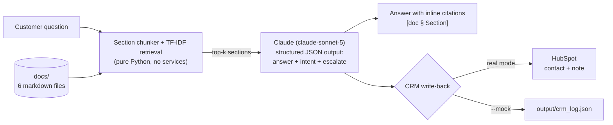

# Case Study: RAG Support Assistant with CRM Write-Back

A working demonstration of the kind of fixed-price integration Kelson Works
delivers: a retrieval-augmented assistant that answers customer questions from
a company's own documents — with a citation for every claim — and logs each
conversation into the CRM with a classified intent and an escalation flag.

The "client" here is **Bluebird Heating & Air**, a fictional HVAC company
invented for this demo. Every document, price, and phone number in `docs/` is
made up. The pipeline, however, is the real thing.

**Run it yourself in under a minute, offline, with zero API keys** — see
[Run the mock demo](#run-the-mock-demo-in-3-commands).

---

## The business problem

A 9-person services company answers the same questions all day: what does a
diagnostic cost, what does the maintenance plan include, can someone come out
today. The answers all exist — in a pricing sheet, a policy doc, an FAQ — but
they live in people's heads and inboxes, so:

- The office answers repetitive questions instead of scheduling billable work.
- Answers drift from the written policy ("I thought the cancel fee was $35?").
- Nothing about the question ever reaches the CRM, so there is no record that
  a customer asked about a maintenance plan three times and never got a call.

The fix is not a chatbot that improvises. It is an assistant that is only
allowed to answer from the company's documents, shows its sources, refuses
when the documents don't cover the question, and files every interaction where
the sales process can see it.

## What this demo does

For each customer question the pipeline:

1. Retrieves the most relevant sections from the six documents in `docs/`.
2. Generates an answer grounded in those sections only, with an inline
   citation after each claim — e.g. `[02-pricing-sheet.md § Financing]`.
3. Classifies the intent (`pricing_inquiry`, `plan_membership`,
   `service_issue`, …) and decides whether a human needs to follow up.
4. Writes the whole interaction — question, answer, intent, escalation flag,
   sources — to the CRM: a HubSpot contact note in real mode, a local JSON
   log in mock mode.

Sample of the actual demo output:

```
[3/4] QUESTION: My AC stopped cooling last night - can someone come out today...
------------------------------------------------------------------------------
Retrieved context:
  0.279  [03-service-policies.md § Scheduling & Priority]
  0.201  [02-pricing-sheet.md § Diagnostic & Service Call Fees]
------------------------------------------------------------------------------
ANSWER (mock mode):
  No-cool calls received before 2:00 pm get same-day priority during peak
  season (June-August), so call the office as early as you can
  [03-service-policies.md § Scheduling & Priority]. ...
------------------------------------------------------------------------------
Intent:    service_issue
Escalate:  yes - Customer has an active no-cool issue ...
CRM:       mock CRM: appended record #3 to .../output/crm_log.json
```

## Architecture



Design choices, and why:

- **Retrieval is dependency-free TF-IDF** (`rag_crm/retriever.py`, ~80 lines,
  stdlib only). For a corpus of a few hundred sections this is accurate,
  instant, and has nothing to deploy or pay for. It is deliberately isolated
  behind one class so swapping in embeddings or a vector database later is a
  contained change, not a rewrite.
- **One model call per question** (`rag_crm/answerer.py`). The Messages API's
  structured-output feature returns the answer, the CRM intent, and the
  escalation decision as one validated JSON object — no second
  classification call, no brittle string parsing.
- **The model is fenced in by the prompt contract**: answer only from the
  retrieved excerpts, cite each claim, and say "I don't have that" rather
  than guess. Prices and policies come from the documents, never from the
  model's memory.
- **Prompt caching breakpoint** on the static system prompt. At this demo's
  size it's below the caching minimum (a documented no-op), but the
  breakpoint is where it belongs, so growing the shared context immediately
  starts saving money.
- **CRM write-back is stdlib `urllib`** — the HubSpot integration adds zero
  dependencies. Contact is found-or-created by email; the note carries the
  full Q&A, intent, and sources.
- **Escalation is explicit.** The assistant cannot book appointments or issue
  refunds; it flags those conversations so a human follows up with full
  context already in the CRM.

## Cost per query

Estimates for `claude-sonnet-5` at its published API pricing as of July 2026:
$2 / $10 per million input/output tokens (introductory pricing through
Aug 31, 2026), then $3 / $15 standard. Token counts measured from this demo's
prompt sizes; your corpus and question lengths will shift them somewhat.

| Scenario | Input tokens | Output tokens | Intro ($2/$10) | Standard ($3/$15) |
|---|---|---|---|---|
| Typical question, 3 retrieved sections | ~1,300 | ~250 | ~$0.005 | ~$0.008 |
| Compound question, 5 retrieved sections | ~2,200 | ~400 | ~$0.008 | ~$0.013 |
| 1,000 typical questions / month | — | — | ~$5/mo | ~$8/mo |

Two things keep this flat as usage grows: retrieval sends only the top-k
sections (cost does not grow with corpus size), and the prompt-cache
breakpoint discounts the shared prefix once it crosses the caching threshold.

## Run the mock demo in 3 commands

No API keys, no network, no `pip install` — mock mode is standard library
only. The Claude call is stubbed with canned-but-realistic responses and the
CRM writes to a local JSON file.

```bash
cd repo-a-claude-rag-crm
python3 demo.py --mock
cat output/crm_log.json
```

You should see four questions answered with citations, and four CRM records
in the log. Ask your own question too:

```bash
python3 demo.py --mock -q "Do you install heat pumps, and what do they cost?"
```

## Run it for real

```bash
pip install -r requirements.txt
cp .env.example .env     # add ANTHROPIC_API_KEY, optionally HUBSPOT_TOKEN
python3 demo.py
```

- `ANTHROPIC_API_KEY` — required; answers come from `claude-sonnet-5`.
- `HUBSPOT_TOKEN` — optional; a HubSpot private-app token with contact read/
  write and note write scopes. Without it, real mode still runs and CRM
  records fall back to the local log.

## Project layout

```
demo.py                  entry point (mock/real, single question or demo set)
rag_crm/
  chunker.py             markdown -> citable section chunks
  retriever.py           pure-Python TF-IDF + cosine similarity
  answerer.py            Claude call (real) / offline stub (mock)
  crm.py                 HubSpot write-back (real) / JSON log (mock)
  pipeline.py            glue: retrieve -> answer -> CRM
docs/                    the fictional company's knowledge base (6 files)
output/crm_log.json      mock CRM log (created on first run, gitignored)
```

## Honest limits and scaling notes

- TF-IDF is keyword-based. It is the right tool up to a few hundred sections;
  beyond that, or for paraphrase-heavy corpora, swap `retriever.py` for
  embeddings — the interface (`search(query, top_k)`) stays the same.
- The mock answerer is a demo stub: canned responses for the scripted
  questions, extractive fallback otherwise. It exists so you can validate the
  pipeline shape offline; answer quality in real mode is the model's.
- One HubSpot note per question is deliberate for a demo. Production builds
  typically batch by conversation and add dedupe and retry (that reliability
  layer is exactly what the second service tier covers).
- No conversation memory — each question stands alone. Multi-turn support is
  an additive change to the answerer, not a redesign.

## What this maps to

This demo is representative of Kelson Works's two smaller fixed-price packages:

| Package | Fixed price | What you get |
|---|---|---|
| Single integration | **$750** | This pattern on your documents and your system: RAG assistant with citations, wired to one destination (CRM, help desk, Slack, email). |
| Multi-system workflow | **$1,850** | The same assistant inside an n8n/Claude workflow spanning multiple systems, with retry logic and human-in-the-loop approval before anything writes back. |

How buying works: pick a package, fill in the intake form, and you get a
working automation within **14 days**. No sales calls, no scoping meetings,
no negotiation — the price is the price. An optional Keep-Alive retainer
($350/mo) covers monitoring, fixes, and model-version updates after delivery.

---

*Bluebird Heating & Air is fictional; all documents in `docs/` were written
for this demonstration. No real customer data is used anywhere in this
repository.*
